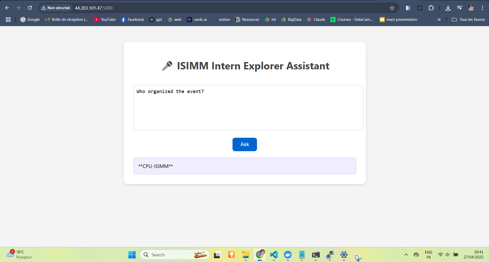

# Event Chatbot

Event Chatbot is a RAG system and chatbot designed to provide answers to questions about event details. It helps event organizers by leveraging open-source models from Hugging Face for question answering.

## Implementations

### 1. Lightweight Implementation
This implementation uses the `google/flan-t5-small` model, a lightweight open-source question answering model with RAG, utilizing the FAISS retriever and `all-MiniLM-L6-v2` for embeddings. The chatbot is deployed on an EC2 instance using Amazon Web Services (AWS) with a complete CI/CD pipeline powered by GitHub Actions. The deployment is dynamic, allowing it to be run locally or on the cloud.

**Demo:**  

### 2. High-Performance Implementation
The second implementation uses the powerful Mistral V3 model via Hugging Face's endpoint. This version maintains the same Flask server setup for handling the endpoints but provides better performance and scalability.

## Features

- Two models for different use cases: lightweight and high-performance.
- Flask server-based architecture for serving endpoints.
- Fully automated CI/CD pipeline with GitHub Actions for seamless deployment.
- Deployed on an EC2 instance with AWS infrastructure.

